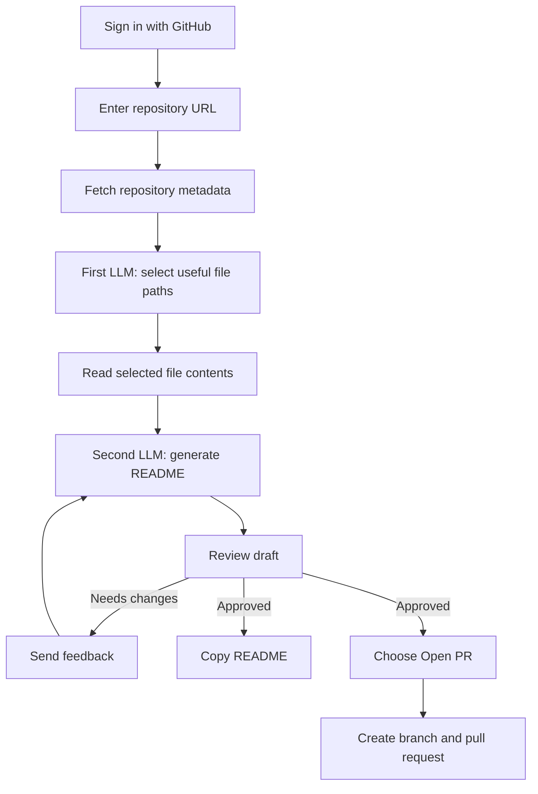
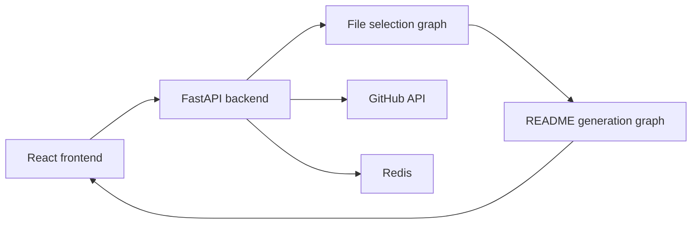

# DocPilot

DocPilot writes your README for you and lets you actually review it before it touches your repo.

Point it at a GitHub repository and it inspects the codebase, figures out which files actually matter for documentation, drafts a README with an LLM, and hands the draft back for you to approve or send back with feedback. Once you're happy with it, DocPilot can open a pull request with the result.


## How it works



The frontend kicks things off with `POST /fetchrepo`. On the backend, that lists and filters the repo's file paths, then sends the shortlist to a first LLM pass (`judge_graph`) whose only job is picking out files worth reading configs, dependency manifests, entry points, that kind of thing. `storingdata` then reads the contents of those files, and a second LLM pass (`readme_graph`) turns them into the actual draft.

The draft doesn't get committed anywhere yet  it pauses for review. `POST /review` either sends it back through the revision loop with your feedback or marks the session complete. Once you're happy, you can copy the Markdown directly or hit `POST /pullrequest` to have DocPilot open a branch and PR with it.

## What it does

- Grounds the README in the repo's actual config and dependency files, instead of guessing
- Keeps what's useful from an existing README and rewrites the parts that don't hold up
- Human-in-the-loop review — nothing ships without your sign-off, and you can iterate with plain feedback
- Markdown preview alongside the raw source, so you can check both before approving
- One click to copy the result, or open a pull request straight from the UI
- Firebase auth up front, GitHub token for repo access

## Architecture



Backend lives in `backend/app`, frontend in `frontend/src`. Review sessions are held in memory via LangGraph's checkpointer for as long as the API process stays up — so a restart mid-review will lose an in-progress session, worth knowing if you're testing this locally.

## Before you start

You'll need:

- Docker and Docker Compose
- A Firebase project with authentication turned on
- A Groq API key
- A Firebase service-account key for the backend
- A GitHub personal access token that can read the target repo, and create branches/PRs if you want to use that feature

## Configuration

Create `backend/app/.env`:

```env
GROQ_API=your_groq_api_key
```

Drop your Firebase service-account JSON at `serviceAccountKey.json` in the repo root — Compose mounts it into the backend container at `/app/app/serviceAccountKey.json`.

The frontend defaults to `http://localhost:8081` for the API. If you're pointing it somewhere else, create `frontend/.env` before building:

```env
VITE_API_URL=http://localhost:8081
```

Keep API keys, Firebase credentials, and personal access tokens out of version control.

## Running it with Docker Compose

```bash
docker compose up --build
```

Frontend: [http://localhost:3000](http://localhost:3000)
Backend: [http://localhost:8081](http://localhost:8081) (interactive docs at `/docs`)

```bash
docker compose down
```

Redis data persists in the `redis_data` Compose volume between runs.

## Running it locally without Docker

### Backend

```bash
cd backend
python -m venv .venv
source .venv/bin/activate
pip install -r requirement.txt
uvicorn app.main:app --reload --port 8081
```

Needs `backend/app/.env` and the Firebase service-account file mentioned above.

### Frontend

```bash
cd frontend
npm ci
npm run dev
```

Vite serves this at [http://localhost:5173](http://localhost:5173) by default. Set `VITE_API_URL=http://localhost:8081` if your API isn't at its default address.

Other useful commands:

```bash
npm run build
npm run lint
```

## API

Every endpoint expects a Firebase bearer token. Repository related endpoints also need an `X-GitHub-Token` header.

| Method | Endpoint | What it does |
| --- | --- | --- |
| `GET` | `/` | Basic health check |
| `POST` | `/fetchrepo` | Fetch a repo and generate the first README draft |
| `POST` | `/review` | Approve the draft, or send it back with feedback |
| `POST` | `/pullrequest` | Open a branch + PR with the README |

Example body for `/fetchrepo`:

```json
{
	"repo_url": "https://github.com/owner/repository"
}
```

The response comes back with `status`, `session_id`, `readme`, and `revision`. Hang on to `session_id` — you'll need it for `/review` while the draft is pending.

## Contributing

PRs welcome, especially anything that makes the generated docs more accurate, easier to review, or safer to run against a real repo.

Good places to dig in:

- Support more dependency/build file formats in `repository_analyzer.py`
- Tighten the prompts, but keep generated claims grounded in what's actually in the repo
- Tests around file selection, workflow transitions, API validation, and auth failures
- Better error states and loading feedback on the frontend
- Improvements to the GitHub branch/PR flow that don't leak credentials

Before opening a PR:

1. Work off a focused branch
2. Keep the change small and explain the actual benefit, not just what changed
3. Never log tokens, service-account contents, or generated data from private repos
4. Update docs and example config if interfaces changed
5. Describe the problem, your approach, and how you verified it in the PR description

## Project layout

```text
backend/
	app/
		Agent/
			readme_workflow.py       # Draft, review, and revision graph
			repository_analyzer.py   # Selects documentation-relevant files
		gitfetch/                  # Repository fetching and pull request helpers
		core/                      # Shared backend services such as Redis
		main.py                    # FastAPI application and API routes
frontend/
	src/
		components/                # React UI and README review flow
		config/api.ts              # API base URL and endpoint definitions
docker-compose.yml             # Backend, frontend, and Redis services
```
